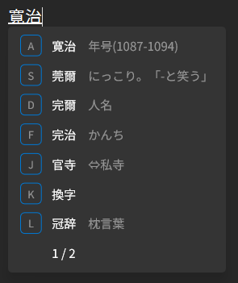
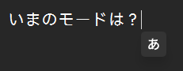
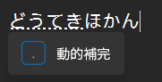
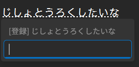
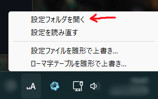

  
  <h1>CrystalSKK</h1>

> An SKK-style Japanese input method for Windows (TSF), written in Rust.
> The documentation is in Japanese, as the software targets Japanese speakers.
> Installs a TSF text input processor (DLL) and a per-user conversion server.
> Source-built releases are produced by GitHub Actions.
> At install time it downloads llama.cpp from its official releases; at run time it downloads the SKK dictionaries listed in the settings.

Windows 向けの SKK 風 IME です。

|  |  |
| --- | --- |
| ↑モダンな見た目 | ↑現在のモードをカーソル近くに表示 |
|  |  |
| ↑動的補完にも対応 | ↑直感的な辞書登録画面 |

## 特徴
- モダンな見た目
    - ライトテーマ/ダークテーマに対応しています。
    - Windows 11 の Acrylic を使った半透明のウィンドウ表示をします。
- ちょっぴり賢い変換候補の提示
    - 小さい言語モデルを同梱し、文脈に応じて変換候補を並べかえて提示します。
    - 処理の重さが気になる場合は無効化することもできます。

## インストール

[Releases](https://github.com/hisaknown/CrystalSKK/releases/latest) から、お使いの Windows に合った MSI (`x64` か `arm64`) をダウンロードして実行してください。  
インストール後、設定 → 時刻と言語 → 言語と地域 → 日本語 → 言語のオプション → キーボード に CrystalSKK が現れます。

インストーラーにはまだ署名がないため、ダウンロードや実行のときに Windows の警告が出ることがあります。

アンインストールは、設定 → アプリ → インストールされているアプリ から行えます。

## 設定

設定はいずれも `%LOCALAPPDATA%\CrystalSKK` 以下のファイルによって行います。

設定ファイルのあるフォルダは、タスクトレイの CrystalSKK アイコンの隣にある、現在の状態を示すアイコン (` A` とか `あ` とかのほう) を右クリックして「設定フォルダを開く」から開くことができます。  

### 振舞いの設定

`%LOCALAPPDATA%\CrystalSKK\config.toml` から設定します。  
すべての設定項目がこのファイルに説明コメントつきで記載されています。

### ローマ字テーブルの設定

`%LOCALAPPDATA%\CrystalSKK\romaji.txt` から設定します。

## 細かい機能の紹介
- 賢い変換候補の提示についての補足
    - ひとつめの候補は常に最近使った候補になります (並べ替えの対象外)。
    - 並べ替え結果が変換に現れる例:
        - 「激しい運動で」→「どうき」を変換したとき、「動悸」が出やすくなります。
        - 「犯行の」→「どうき」を変換したとき、「動機」が出やすくなります。
        - 「新卒入社の」→「どうき」を変換したとき、「同期」が出やすくなります。
- 動的補完
    - SKKFEP ~~をパクった~~ にインスパイアされた機能です。
    - 入力中の文字列に応じて、変換候補を動的に補完します。デフォルトでは `.` 打鍵で候補を確定します。
- 自動カタカナ語辞書
    - SKKFEP ~~をパクった~~ にインスパイアされた機能です。
    - 指定の辞書から自動的にカタカナ語辞書を生成し、変換候補に追加します。

## 開発

ソースからのビルドと導入、ログの見方などは [docs/development.md](docs/development.md) を参照。

## See Also

- [CorvusSKK](https://github.com/nathancorvussolis/corvusskk)
- [SKK日本語入力FEP](http://coexe.web.fc2.com/skkfep.html)

## Code signing policy

Free code signing provided by [SignPath.io](https://about.signpath.io/), certificate by [SignPath Foundation](https://signpath.org/)

- Committers and reviewers: [hisaknown](https://github.com/hisaknown)
- Approvers: [hisaknown](https://github.com/hisaknown)

署名するのは、このリポジトリのソースから GitHub Actions でビルドしたものだけです。

### Privacy policy

This program will not transfer any information to other networked systems unless specifically requested by the user or the person installing or operating it.

CrystalSKK がネットワークにつなぐのは、次のものを取得するときだけです。利用者の入力や辞書の中身を送ることはありません。

- インストールのとき: [llama.cpp](https://github.com/ggml-org/llama.cpp) の公式リリースと、このリポジトリのリリースに置いた言語モデル (いずれも GitHub から)
- 動作中: 設定ファイルに並べた辞書 (既定では [skk-dev/dict](https://github.com/skk-dev/dict) の SKK-JISYO.L)

## ライセンス

MIT License ([LICENSE](LICENSE))

SKK 辞書は同梱していません。設定されたものを動作時に自動的にダウンロードします。  
SKK 辞書はそれぞれのライセンス (SKK-JISYO.L は GPL 系) に従います。
